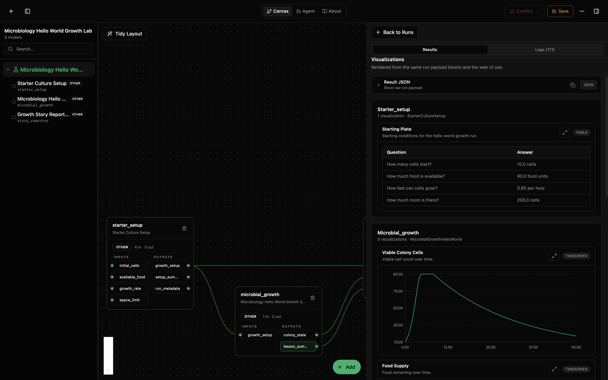
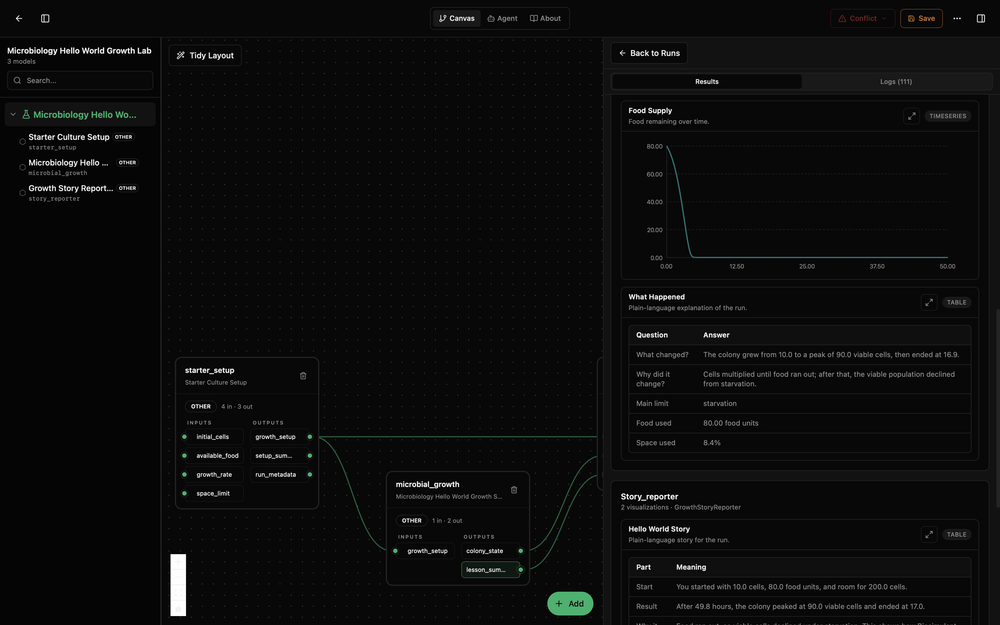
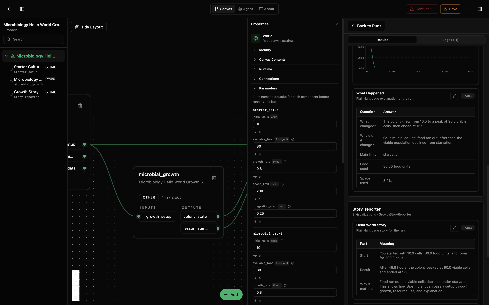

# Microbiology Hello World Growth Lab

This beginner lab shows how Biosimulant can connect several simple models into one friendly story. You choose a starting plate, viable cells grow while food is available, and the final node explains why the colony declines after starvation begins.

## What You'll See

The canvas has three steps:

1. `starter_setup`: choose the starting plate.
2. `microbial_growth`: watch viable cells eat, multiply, run out of food, and decline.
3. `story_reporter`: read the result and try a next experiment.

With the bundled defaults, the run produces viable-cell and food charts plus simple tables for the setup and story. The screenshots below show the same lab run for 50 hours so the post-food starvation decline is visible.



The first view shows the three-model canvas next to the Results panel. `starter_setup` records the starting plate, while `microbial_growth` plots viable cells rising to a peak and then declining after food is exhausted.



The second view shows the food curve reaching zero, the plain-language "What Happened" table, and the story reporter explaining that starvation is now the main limit.



The third view shows the editable parameters alongside the results, so a new user can connect each simple control to the final story.

## How to Read the Visualizations

The viable-cell chart shows how many living cells are present over time. A steep upward line means the colony is multiplying quickly. A downward line after food reaches zero represents starvation death in this teaching model.

The food chart shows food units left over time. When it reaches zero, the colony cannot add new cells, and viable cells begin to decline at the built-in starvation rate.

The setup and story tables restate the starting plate, the main bottleneck, and simple changes to try next.

## What This Lab Contains

| Path | Purpose |
|---|---|
| `lab.yaml` | Public lab controls, outputs, model list, and wiring. |
| `wiring-layout.json` | Three-node canvas layout. |
| `models/starter-culture/` | Setup model that turns four controls into a starting plate. |
| `models/microbial-growth/` | Middle model that simulates viable-cell growth and starvation decline. |
| `models/growth-story/` | Story model that explains the growth results. |
| `tests/` | Integration tests for the three-model lab. |
| `assets/` | Screenshots for the lab README. |

## Inputs

| Input | Meaning |
|---|---|
| `initial_cells` | How many cells are on the plate at the start. |
| `available_food` | How much food is available. |
| `growth_rate` | How quickly the cells can multiply when food and space are available. |
| `space_limit` | Approximate maximum colony size the space can hold. |

## Outputs

| Output | Meaning |
|---|---|
| `colony_state` | Current viable cell count, food remaining, starvation loss, and main limit. |
| `lesson_summary` | Short explanation from the growth model. |
| `hello_world_story` | Plain-language story that combines setup and growth. |
| `next_steps` | Simple ideas for changing the next run. |

## Running with the Bundled Defaults

```bash
python3 examples/run_example.py microbial-growth
```

Try changing one knob:

```bash
python3 examples/run_example.py microbial-growth --hours 10 --initial-cells 20 --food 120 --space-limit 250
```

Reproduce the longer starvation screenshots:

```bash
python3 examples/run_example.py microbial-growth --hours 50
```

The example configuration lives at `examples/microbial-growth/config.yaml`.

## Running in Biosimulant Desktop

Import the lab from the repository root:

```bash
biosimulant labs import /Volumes/dem-ssd/imp/projects/Nitoons/Biosimulant/models/models-microbiology-hello-world/labs/microbiology-hello-world-growth
```

## Notes

This is an educational model, not a publication-grade microbiology model. It is intentionally small so new users can see how inputs, wiring, model outputs, and visual summaries fit together.

The growth math is a simple resource-limited teaching simulation. It includes a default starvation-death term so the post-food phase is easier to understand, but it is not calibrated to a real organism and should not be used to make organism-specific or clinical decisions.
